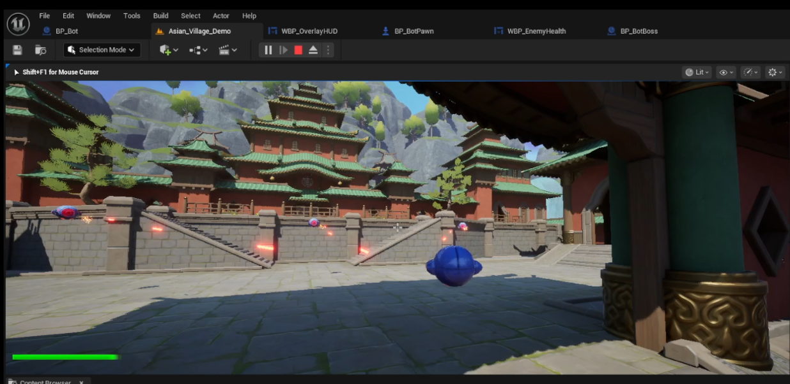
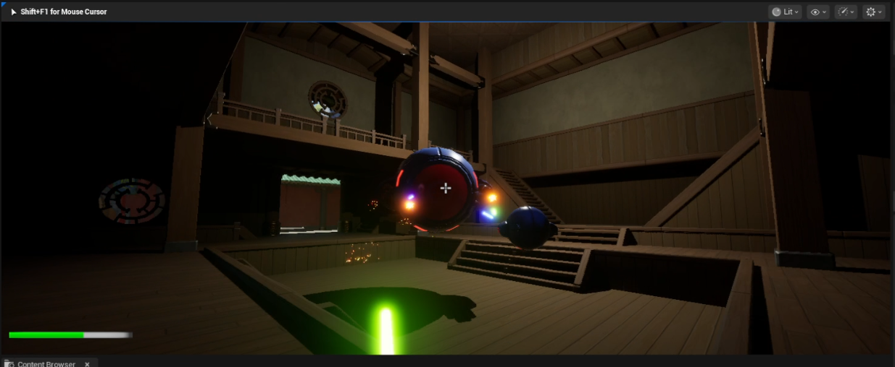

# BadBot Unreal Engine 5 Project

## Overview

BadBot is an Unreal Engine 5 project designed for gameplay and blueprint experimentation. The project features a variety of assets, blueprints, and maps, making it a flexible base for prototyping or expanding into a full game.
## Gameplay Video
- https://youtu.be/VZ4C8rng3Jg

## Project Structure

- **Config/**: Project configuration files (input, engine, game settings).
- **Content/**: Main game content, including:
  - **Asian_Village/**: Environment assets, blueprints, maps, materials, meshes, and textures.
  - **Assets/**: Additional asset packs (BlasterBeam, Drone, FX, etc.).
  - **Blueprints/**: Core gameplay blueprints (BotPawn, Game, UI, etc.).
  - **Maps/**: Playable levels (BotLevel, TestingLevel).
- **DerivedDataCache/**, **Intermediate/**, **Saved/**: Generated and cached files (can be ignored for version control).

## Getting Started

1. **Requirements**
   - Unreal Engine 5.x (latest recommended)
   - Windows 10/11
2. **Setup**
   - Clone or download the repository.
   - Open `BadBot.uproject` with Unreal Engine 5.
   - Let Unreal build any missing binaries or shaders.
3. **Running the Project**
   - Click Play to start testing.

## Notable Features

- Modular blueprints for bots, drones, and weapons.
- Rich environment assets (Asian Village theme).
- Example maps for testing and demonstration.
- Organized folder structure for easy navigation.

## Credits

- Epic Games for Unreal Engine 5
- Asset creators (see `Content/Asian_Village/` and `Assets/` for details)

---
